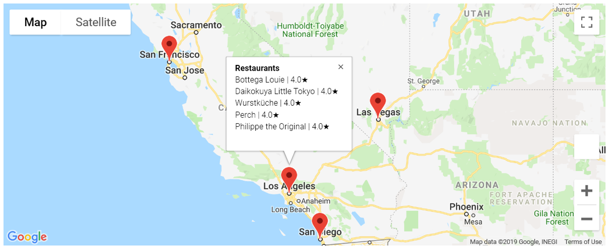

# Top Restaurants by Major Metropolitan Cities

Using Yelp, Google Geocode, and Google Maps APIs to analyse food trends in each of America's top 10 food cities. The data extracted from Yelp is used to find the most expensive city in terms of food, the most popular cuisines overall, and the most popular cuisines in each city. Google Geocode and Maps APIs are used to determine the locations of the top 5 restaurants in each city and display them on an interactive map.

### Steps:
* Collect data from APIs
* Clean data
* Analyse trends
* Visualize data
* Provide observations/conclusions

- - -
